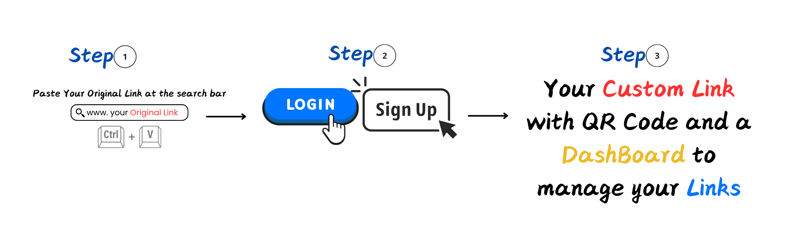
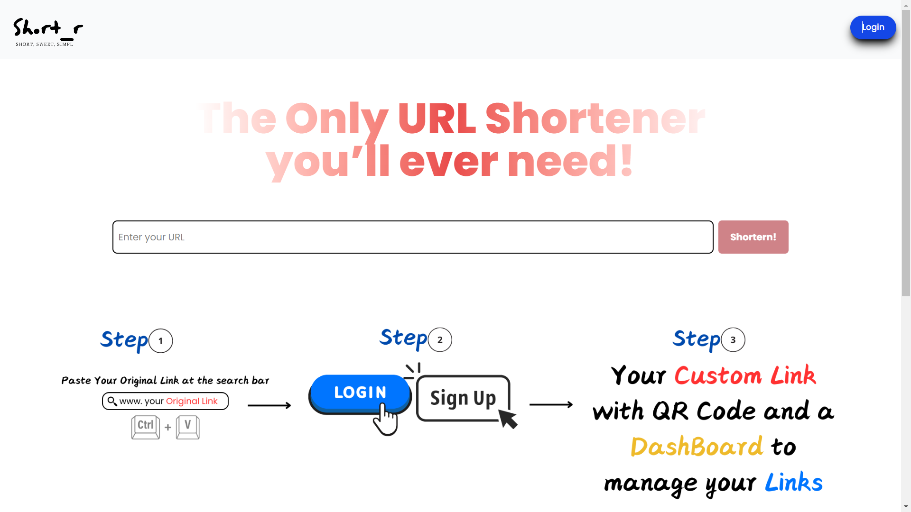
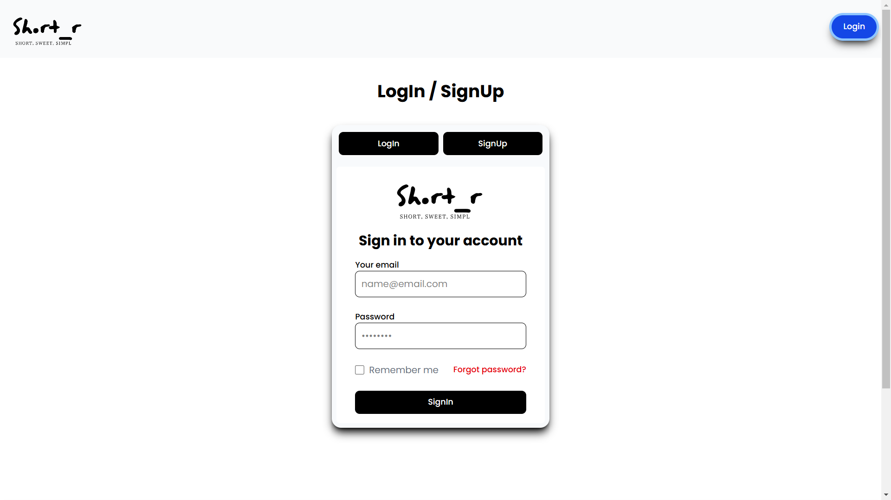
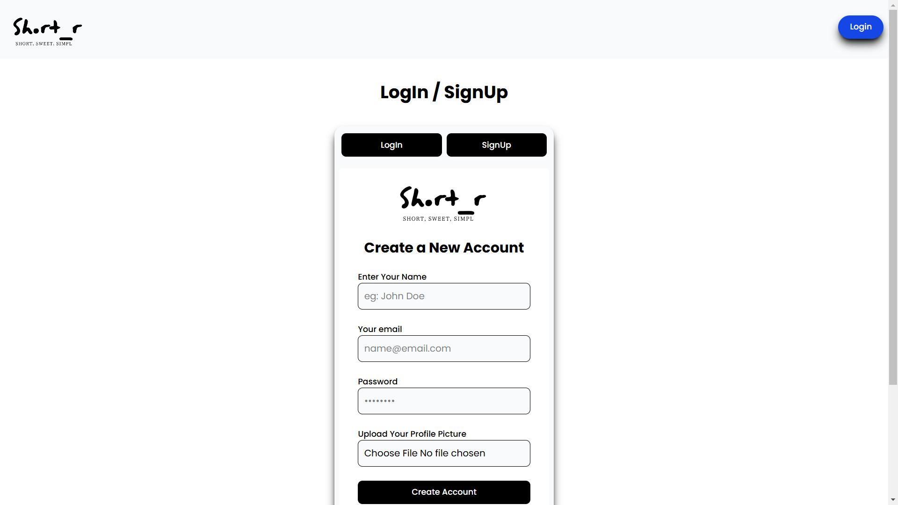
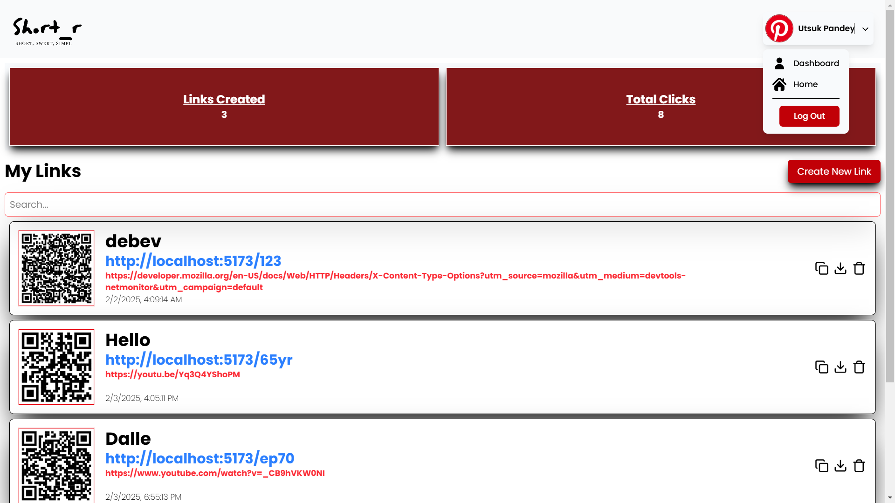
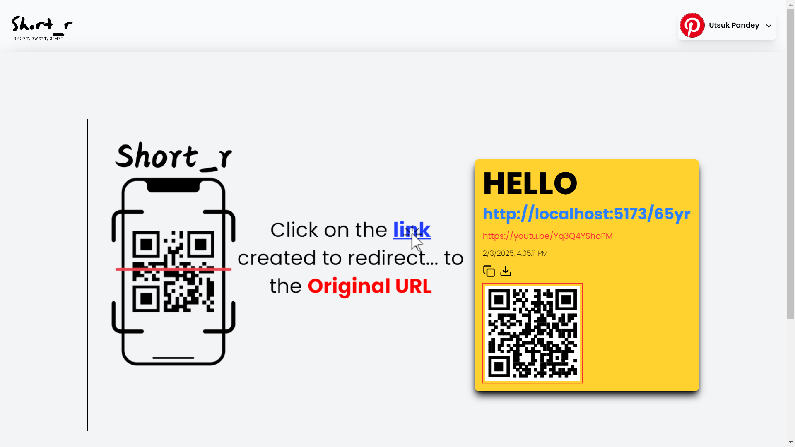

# 🔗 **Short_r – A Fast & Simple URL Shortener with QR Code Generation** 🚀

<div style="display: flex; justify-content: center; align-items: center; height: 200px; width: 100%; overflow: hidden;">
  
</div>


**Short_r** is a sleek, user-friendly **URL shortener** designed to make link sharing easy and efficient. Whether you're shortening long URLs or generating QR codes, **Short_r** provides a smooth, intuitive experience powered by **React** and **Supabase**.  

---

## 🌟 **Features** ✨

- **📏 Instant URL Shortening:** Paste your long URL, and instantly get a shortened link!  
- **📸 QR Code Generation:** Every shortened link generates a **scannable QR code** 🔲  
- **📊 Dashboard Overview:** View the number of links you’ve created and track how many times each link has been clicked  
- **🔄 Link Management:** Copy, delete, or download your **QR codes** with just a click  
 
- **🔒 Secure User Authentication:** Sign in securely using **Supabase Authentication**  
- **🛠️ Full CRUD Operations:** Create, read, update, and delete your links directly from the dashboard  

---

## 🛠️ **Tech Stack** 💻

- **Frontend:**  
  - ⚛️ React (Vite)  
  - 🚗 React Router DOM (for smooth navigation)  
  - 🔄 Context API (for state management)  
  - 🪝 Custom React Hooks (for reusability and organization)  
- **Backend:** 
  - 📦 Node.js 
  - 🔐 Supabase (Authentication & PostgreSQL)  
  - 🔗 API calls to interact with the database  
- **Other:**  
  - 🖼️ QR Code generation  
  - 🔄 CRUD operations for managing URLs and data  

---

# Website WorkFlow

## Workflow:

   <div>
    
  </div>

## Screenshots of the Websites:

### Landing Page:
  <div>
    
  </div>

### Authentication Page:
  <div>
    
  </div>

  <div>
    
  </div>

### Dashboard Page:
  <div>
    
  </div>

### CreateLink:
  <div>
    
  </div>

### Link Page:
  <div>
    
  </div>


## ⚡ **Getting Started** 🏁

### 1️⃣ **Clone the Repository**  
First, clone this repository to your local machine:

```bash
git clone https://github.com/yourusername/short_r.git
cd short_r
```

### 2️⃣ **Install Dependencies**  
Make sure you have **Node.js** and **npm** installed. Then, install the dependencies:

```bash
npm install
```

### 3️⃣ **Set Up Supabase** 🛠️  
- Create a **Supabase** account at [supabase.io](https://supabase.io/)  
- Create a new **Supabase project** and obtain your **API URL** and **Anon Key**  
- Add your keys to the **.env** file in the root directory:

```plaintext
VITE_SUPABASE_URL=your_supabase_url
VITE_SUPABASE_ANON_KEY=your_supabase_anon_key
```

### 4️⃣ **Run the Project Locally** 🌐  
Run the following command to start the app locally:

```bash
npm run dev
```

Once the app is running, open your browser and visit `http://localhost:5173` to see **Short_r** in action! 🌟

---

## 📂 **Folder Structure** 🗂️

Here’s an overview of how the project is organized:

```
short_r/
│── src/
│   ├── components/  # Reusable UI components (Header, Footer, LinkCard, Authentication Page, Dropdown for User, etc)
│   ├── hooks/       # Custom hooks (useFetch hook)
│   ├── pages/       # Pages for Home, Dashboard, Link, Redirect, etc.
│----context/     # React Context API (context.js)
│   ├── db/        # API functions to interact with Supabase
│         ├── apiURls/ # for Url fetching from database
│         ├── apiAuth/ # api for authentication
│         ├── apiClicks/ #api for clicks retrieval
│   ├── App.jsx      # Main React component
│   └── main.jsx     # React entry point
│── public/          # Static assets (images, icons)
│── .env             # Environment variables
│── package.json     # Project dependencies
```

---

## 📡 **API & Database Setup** 🗃️

This project uses **Supabase** for the backend (authentication and database) and offers the following features:

- **API Endpoints:**
  - `POST /api/apiUrls` – Shortens the URL and stores it in the Supabase database  
  - `DELETE /api/apiAuth` – Authenticate the users from the database 
  - `GET /api/apiClicks` – Retrieves stats for a specific link (click count) 📊  

- **Database Schema:**  
  - **Tables and the Schema:**  

  <div>
    
  </div>

---


## 🔮 **Future Enhancements** 🚀

Here are some exciting features that will be coming soon:

- **📈 Analytics Dashboard:** Track detailed stats on where and how your links are clicked  
- **📝 Custom Short Links:** Allow users to create custom aliases (e.g., `short_r.com/myLink`)  
- **👤 User Profiles:** Each user can manage their own set of links and view stats in a personalized dashboard  
- **🎨 UI Improvements:** Continuous improvements to make the user experience even more intuitive and modern  

---

## 🤝 **Contributing** 💬

Contributions are always welcome! Here’s how you can get involved:

1. Fork the repository  
2. Create a new branch for your feature  
3. Make your changes, test them, and ensure the app works smoothly  
4. Submit a pull request with a detailed explanation of your changes  

Let's make **Short_r** even better together! 🌍✨

---

## 📄 **License** 📝

This project is licensed under the **MIT License** – see the [LICENSE](LICENSE) file for details.  

---

### 💬 **Feedback & Discussions** ✨

Your feedback is incredibly valuable to me! If you have any ideas, suggestions, or questions, feel free to open an issue, submit a pull request, or contact me directly! Let’s improve **Short_r** together! 💪  

---

🚀 **Developed with ❤️ by [Utsuk Pandey | PlasmaARC](https://github.com/yourusername)**  
